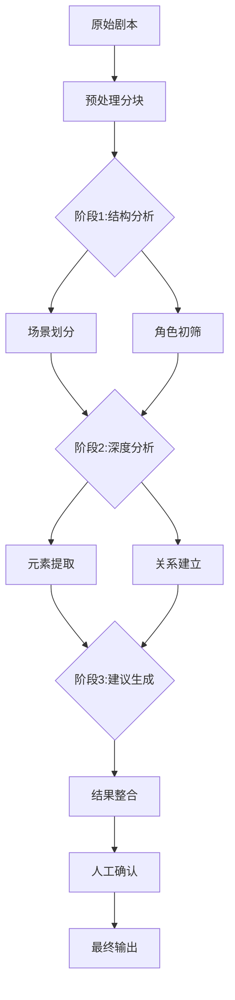

# 制片管理网站 PRD 文档 (基于AI大模型版本)

## 1. 项目概述

### 1.1 项目背景
开发一个基于AI大模型的制片管理网站，利用OpenAI API实现剧本的智能解析，自动提取关键制片元素，并生成专业制片管理表格，大幅提升影视制作前期准备效率。

### 1.2 项目目标
- 利用大模型实现剧本的深度理解和元素提取
- 生成符合行业标准的制片管理表格
- 提供AI辅助的制片决策建议
- 建立智能化的影视制作前期工作流程

## 2. 功能需求

### 2.1 核心功能

#### AI剧本解析器
- 支持上传剧本文件（PDF/DOCX/TXT格式）
- 通过OpenAI API实现：
  - 剧本结构分析（场景分割、时间线梳理）
  - 智能元素识别（角色、场景、服装、道具等）
  - 上下文关联分析（角色-场景-道具关系网）
  - 潜在需求推断（基于场景的隐含需求识别）

#### AI增强数据输出
- 角色提取表（含角色关系分析）
- 场景分解表（含AI建议的拍摄难度评估）
- 智能顺场表（AI优化的拍摄顺序建议）
- 排期表（含AI生成的资源冲突预警）
- 服化道总表（含AI补充的潜在需求建议）

#### 用户界面
- 剧本上传与AI解析进度展示
- 解析结果可视化展示
- AI建议与人工确认交互流程
- 多格式导出功能

### 2.2 技术需求

#### 后端 (Python)
- 文件上传预处理
- OpenAI API集成与调用优化
- 提示工程(Prompt Engineering)设计
- 结果后处理与结构化
- 缓存与异步处理机制

#### 前端 (JavaScript)
- 文件上传与处理状态展示
- AI解析结果可视化
- 人工审核与修正界面
- 表格展示与导出

#### 数据库
- 用户项目存储
- AI解析结果缓存
- 修改历史记录

## 3. 系统架构

### 3.1 技术栈
- **后端框架**: FastAPI (Python)
- **AI服务**: OpenAI API (GPT-4)
- **前端框架**: Next.js (React)
- **数据库**: MongoDB (处理非结构化AI输出)
- **文件存储**: AWS S3
- **任务队列**: Celery (处理异步AI调用)

### 3.2 数据流
1. 用户上传剧本文件
2. 后端预处理文件并分块
3. 通过精心设计的prompt调用OpenAI API
4. 多轮AI处理与结果整合
5. 结构化处理AI输出
6. 前端展示并提供交互修改

## 4. 详细功能说明

### 4.1 AI剧本解析器

#### 输入处理
1. 文件预处理：
   - PDF/DOCX转文本
   - 智能分段处理
   - 敏感信息过滤

2. 分块策略：
   - 按场景分块处理
   - 上下文保留机制
   - 长文本处理优化

#### AI处理流程
```python
# 示例AI调用逻辑
async def analyze_with_ai(text_chunk):
    prompt = f"""
    你是一个专业的影视制片分析AI，请从以下剧本片段中提取信息：
    {text_chunk}
    
    请按以下JSON格式返回：
    {{
        "scenes": [{
            "number": "场景编号",
            "location": "地点",
            "time": "时间",
            "characters": ["角色1", "角色2"],
            "props": ["道具1", "道具2"],
            "special_notes": "特殊说明"
        }],
        "characters": [{
            "name": "角色名",
            "type": "角色类型",
            "description": "角色描述"
        }]
    }}
    """
    
    response = await openai.ChatCompletion.create(
        model="gpt-4",
        messages=[{"role": "user", "content": prompt}],
        temperature=0.3
    )
    
    return parse_ai_response(response)
```

#### 结果整合
- 多轮调用结果去重
- 上下文关联建立
- 置信度标注
- 人工确认点标识

### 4.2 AI增强输出表格

#### 智能角色表
| 角色名称 | 出现场景 | 关系网络 | AI建议选角特征 | 服装AI建议 |
|---------|---------|---------|---------------|-----------|
| 张三    | 1,3,5   | 李四(对手),王五(盟友) | 年龄35-45岁，气质沉稳 | 商务正装为主 |

#### AI优化顺场表
| 拍摄顺序 | 场景 | AI推荐理由 | 预计耗时 | 资源冲突预警 |
|---------|-----|-----------|---------|-------------|
| 1       | 外景-日 | 光线条件稳定 | 4小时 | 主演李四当天有其他组戏 |

## 5. API 设计

### 5.1 后端API端点

#### AI处理相关
- `POST /api/ai/analyze` - 提交文本分析请求
- `GET /api/ai/status/{task_id}` - 获取分析状态
- `POST /api/ai/refine` - 请求AI对特定部分细化分析

#### 数据交互
- `POST /api/data/confirm` - 确认AI分析结果
- `POST /api/data/correct` - 提交人工修正

### 5.2 AI提示设计策略

#### 分层提示设计
1. **结构识别提示**：识别剧本基本结构
2. **元素提取提示**：针对特定元素的深度提取
3. **关联分析提示**：建立元素间关系
4. **建议生成提示**：提供制片建议

#### 示例场景分析提示
```
你是一个有30年经验的场记专家，请分析以下场景：

{场景文本}

请思考：
1. 这个场景中容易被忽略的道具需求是什么？
2. 这个场景的特殊拍摄需求有哪些？
3. 与前后场景的衔接需要注意什么？

用专业场记术语回答，包含但不限于：
- 道具清单
- 服装要求
- 特殊设备
- 人员配置
- 潜在问题预警
```

## 6. 前端界面设计

### 6.1 AI特色界面元素

#### AI解析状态面板
- 实时显示AI分析进度
- 展示正在分析的内容片段
- 置信度指示器

#### AI建议交互组件
- 接受/拒绝AI建议的快捷操作
- 建议理由展示
- 类似案例参考

#### 差异对比视图
- AI原始输出与人工修改的对比
- 修改历史回溯
- 版本差异高亮

## 7. 项目里程碑

### 阶段1: AI基础集成 (3周)
- 实现OpenAI API集成
- 设计核心提示模板
- 建立异步处理流程
- 基础结果展示界面

### 阶段2: 智能分析增强 (4周)
- 优化分层提示策略
- 实现复杂元素关联分析
- 开发AI建议系统
- 构建人工确认流程

### 阶段3: 生产优化 (2周)
- 性能优化与缓存策略
- 成本控制机制
- 错误处理与重试逻辑
- 用户体验打磨

## 8. AI特定考虑因素

### 8.1 性能与成本优化
- 文本分块策略优化
- 结果缓存机制
- 异步处理流程
- 限流与配额管理

### 8.2 质量保障措施
- 交叉验证机制
- 置信度阈值设置
- 关键点人工确认
- 持续提示工程优化

### 8.3 特殊处理需求
- 长上下文管理
- 行业术语处理
- 多轮细化分析
- 歧义内容标注

## 附录A: AI处理详细设计

### 多阶段AI分析流程



### 错误处理机制
```python
async def safe_ai_call(prompt, max_retries=3):
    retries = 0
    while retries < max_retries:
        try:
            response = await openai.ChatCompletion.create(
                model="gpt-4",
                messages=[{"role": "user", "content": prompt}],
                timeout=30
            )
            return response
        except Exception as e:
            retries += 1
            if retries == max_retries:
                raise AIAnalysisError(f"AI调用失败: {str(e)}")
            await asyncio.sleep(2 ** retries)
```

## 附录B: 测试策略

### AI特定测试用例

1. **提示工程测试**
   - 不同提示模板的效果对比
   - 复杂场景的解析能力测试
   - 行业术语理解测试

2. **边界情况测试**
   - 非标准格式剧本处理
   - 模糊描述的解析能力
   - 文化特定内容的处理

3. **性能测试**
   - 长剧本处理时长
   - 多并发请求处理
   - 令牌使用优化

4. **回归测试集**
   - 建立标准测试剧本集
   - 关键指标监控(召回率、准确率)
   - 版本升级对比测试

